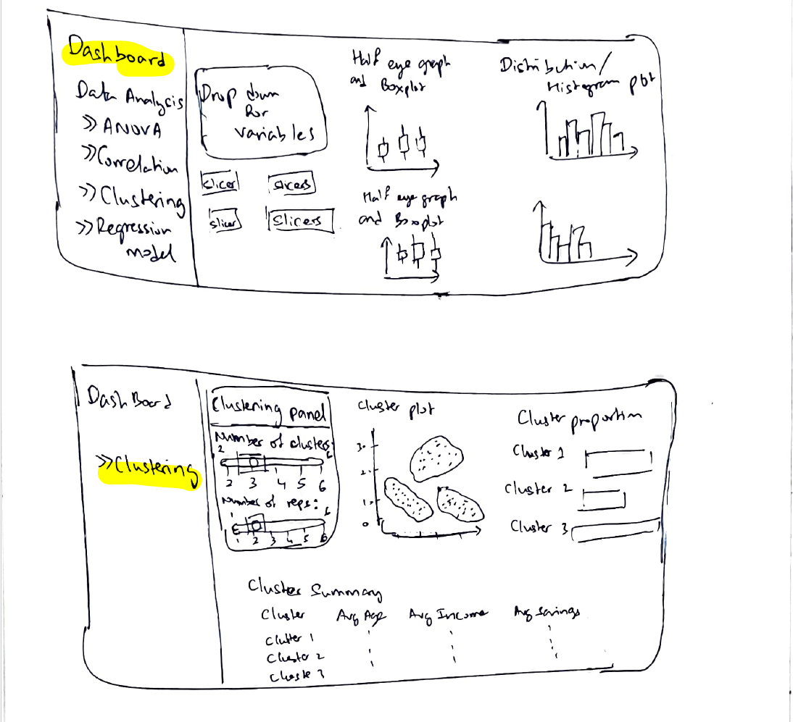

## 1 Overview

This section presents the proposed user interface design for the clustering module of the Shiny application. The prototype focuses on supporting customer segmentation analysis in the Colombian fintech ecosystem.

The UI design is developed as a storyboard rather than a final Shiny implementation. Its purpose is to illustrate the proposed page layout, the major interface components, the analytical outputs to be displayed, and the expected user interactions. The storyboard helps translate the clustering workflow into an interactive visual analytics dashboard.

## 2 Proposed Module

The proposed module is a **Customer Clustering Dashboard** designed to allow users to explore customer segments based on behavioural, financial, and demographic characteristics.

The dashboard supports clustering analysis by enabling users to:

-   select variables for clustering,

-   adjust clustering parameters,

-   visualize the resulting cluster structure, and

-   compare cluster characteristics through summary tables and proportion charts.

This design allows users to interactively examine how customers are grouped and how the identified clusters differ from one another.

##3 Storyboard of Proposed UI

## 4 Overall Layout Design

The proposed dashboard adopts a three-zone layout.

### 4.1 Header Section

The top portion of the interface is reserved for the dashboard title. This helps users immediately understand the purpose of the module and the type of analysis being performed.

The header is designed to display:

-    the module title, and

-    the analytical context of customer clustering.

### 4.2 Sidebar Panel

The left sidebar is used to present the main analytical modules of the application and support navigation. In the storyboard, the clustering module is highlighted as the active section.

This area is intended to help users move between different analytical tasks such as:

-    ANOVA,

-    correlation analysis,

-    clustering, and

-    regression modelling.

-    Within the clustering page, the sidebar visually anchors the selected module and provides a consistent navigation structure across the Shiny application.

### 4.3 Control Panel

The upper-left section of the main content area is designed as the clustering control panel. This section contains the user input controls required to configure the clustering analysis.

The proposed controls include:

-    a variable selection control to choose the features used for clustering,

-    a slider to set the number of clusters,

-    a slider or numeric control to set the number of repetitions / starts for the clustering algorithm, and

-    an action button to run or update the clustering procedure

-    This design allows users to modify the segmentation settings interactively and examine how the clustering results change under different parameter choices.

### 4.4 Main Visual Panel

The central and right sections of the dashboard are reserved for visual outputs of the clustering analysis.

The proposed outputs include:

-    a cluster plot showing the separation of customer groups in reduced-dimensional space,

-    a cluster proportion chart showing the relative sizes of the identified clusters, and

-    a cluster summary table presenting the average values of key attributes such as age, income, and savings for each cluster.

-    This arrangement allows users to simultaneously inspect the structure, size, and characteristics of the identified customer segments.

## 5 Proposed UI Components

The table below summarises the key interface elements and their intended roles in the dashboard.

| UI Component | Purpose |
|----|----|
| `sidebarPanel()` / navigation menu | Allows users to move across different analytical modules in the application |
| `selectInput()` / `pickerInput()` | Allows users to choose clustering variables |
| `sliderInput()` | Allows users to adjust the number of clusters and repetitions |
| `actionButton()` | Triggers the clustering procedure |
| `plotOutput()` | Displays the cluster plot and cluster proportion chart |
| `tableOutput()` / `DT::dataTableOutput()` | Displays the cluster summary table |
| `mainPanel()` | Organises the visual and tabular outputs of the clustering module |

## 6 Explanation of User Interaction Flow

The proposed user interaction flow is designed to be simple and aligned with the clustering analysis process.

First, the user navigates to the clustering module from the sidebar. Next, the user selects the variables to be included in the clustering process and adjusts the clustering parameters, such as the number of clusters and the number of repetitions. After running the analysis, the dashboard displays the cluster plot, the proportion chart, and the cluster summary table.

The cluster plot helps users visually assess the separation between customer groups, while the proportion chart shows the relative size of each segment. The summary table provides a more interpretable comparison of key customer attributes across clusters. Together, these outputs allow users to move from computational results to practical customer insights.

## 7 UI Design Rationale

The proposed design follows several important visual analytics and dashboard design principles.

First, the separation between navigation, controls, and outputs improves usability by clearly distinguishing analytical inputs from results. Second, placing the clustering control panel near the top-left of the main panel supports a natural workflow in which users first configure the analysis and then review the results. Third, combining graphical and tabular outputs improves interpretability by allowing users to understand both the visual cluster structure and the numerical characteristics of each segment. Finally, the inclusion of a proportion chart supports quick comparison of cluster sizes, which is important when assessing whether one dominant customer group exists.

Overall, the design is intended to support both exploration and interpretation, allowing users to experiment with segmentation settings and understand the resulting customer profiles in a clear and structured way.

## 8 Conclusion

The storyboard presents a dashboard-oriented UI design for the clustering module of the proposed Shiny application. It translates the customer segmentation workflow into an interactive structure consisting of a sidebar, a clustering control panel, a cluster visualization area, a cluster proportion chart, and a summary table.

This design provides a practical foundation for the later development of the full Shiny application while ensuring that the proposed interface remains aligned with usability, interpretability, and visual analytics principles.
